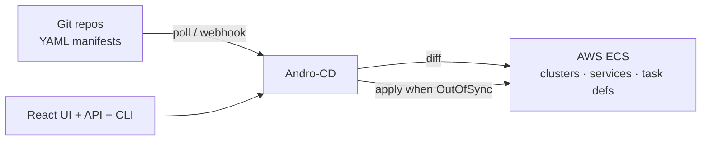

# Andro-CD

**Pull-based GitOps for AWS ECS** — the ArgoCD model (watch Git → diff → reconcile),
applied to ECS services, task definitions, scheduled tasks and clusters. One Docker
image, a React dashboard, and your manifests in Git as the single source of truth.

[Get started](getting-started.md){ .md-button .md-button--primary }
[View on GitHub](https://github.com/cyberlabrs/andro-cd){ .md-button }

---

<div class="grid cards" markdown>

-   :material-sync:{ .lg .middle } **GitOps reconciliation**

    ---

    Polls your repos (or reacts to webhooks), diffs desired vs live AWS state and
    applies the difference — with sync waves, pre/post-sync hooks, self-heal and
    safe pruning.

-   :material-view-dashboard:{ .lg .middle } **Argo-style dashboard**

    ---

    Sync & health per app, side-by-side diff, live CloudWatch logs (SSE), task
    forensics, one-click sync/rollback/prune, dark mode, URL-shareable filters.

-   :material-cube-outline:{ .lg .middle } **Four kinds**

    ---

    `ECSService`, `ECSScheduledTask` (EventBridge cron), `ECSServiceSet`
    (app-of-apps generators) and `ECSCluster` — the cluster itself managed from Git.

-   :material-shield-check:{ .lg .middle } **Production-grade security**

    ---

    GitHub OAuth + RBAC, API tokens for CI, audit log, CSP/CSRF/rate limits,
    encrypted multi-account AWS profiles, non-root container.

-   :material-cash-multiple:{ .lg .middle } **Cost-aware deployments**

    ---

    Fargate Spot capacity provider strategies, target-tracking autoscaling,
    labels propagated to AWS tags for cost allocation, task-definition cleanup.

-   :material-server-network:{ .lg .middle } **Built for operations**

    ---

    HA leader election, dry-run mode, sync windows (deploy freeze), Prometheus
    metrics, Slack notifications, readiness probes, values-file templating.

</div>

## How it works



1. Connect one or more Git repositories from the UI (HTTPS token, SSH key or GitHub App).
2. Push YAML manifests — Andro-CD validates, diffs and (auto-)syncs them to AWS.
3. Watch sync status, health, diffs and logs in the dashboard; roll back with one click.

## A manifest in 20 lines

```yaml
apiVersion: andro-cd/v1
kind: ECSService
metadata:
  name: web-app
  labels: {team: platform}
spec:
  region: eu-central-1
  cluster: production
  service:
    desiredCount: 2
    launchType: FARGATE
  network:
    subnets: [subnet-aaa, subnet-bbb]
    securityGroups: [sg-0123]
  taskDefinition:
    containers:
      - name: web
        image: nginx:1.27
        portMappings: [80]
        logGroup: /ecs/web-app
```

That's a running, monitored, drift-detected ECS service. Everything else —
autoscaling, load balancers, Spot, hooks, health checks — is opt-in.

[Read the manifest reference →](manifest.md)
